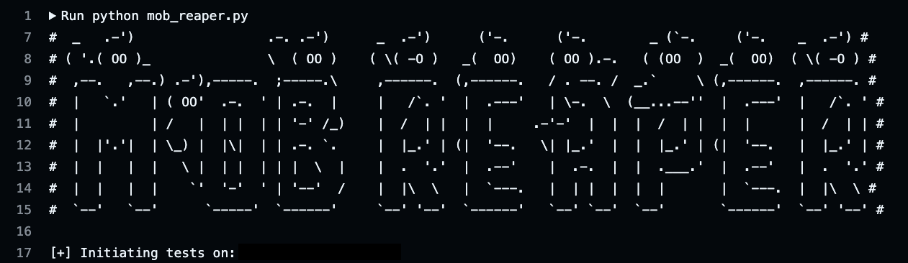

# MobReaper: Runtime Mobile Application Test Suite

[](https://github.com/cassio-santos-ptk/mobile-automated-workflow/commits/main/)
[](https://github.com/cassio-santos-ptk/mobile-automated-workflow/graphs/contributors)



## Get Started

### Dependencies


### Python
Grapefruit requires [Python](https://www.python.org/) to be installed.

### Genymotion
Setup genymotion on your device: https://www.genymotion.com/product-desktop/download/

> Start `Cydia` and add Frida’s repository by going to `Manage` -> `Sources` -> `Edit` -> `Add` and enter `https://build.frida.re`. You should now be able to find and install the `Frida` package which lets Frida inject JavaScript into apps running on your iOS device. This happens over USB, so you will need to have your USB cable handy, though there’s no need to plug it in just yet.

### Setup

Grapefruit is now on npm as [igf](https://www.npmjs.com/package/igf)! Interprets as iGrapefruit or maybe iOS Graphical Frida

`npm install -g igf`

Now you have the grapefruit cli as `igf`:

```
~ igf --help

Usage: igf [options]

Options:
  -h, --host <string>  hostname (default: "127.0.0.1")
  -p, --port <number>  port of the server side (default: 31337)
  --help               display help for command
```

Default URL for the web UI is `http://localhost:31337`

*Security Warning*

At this moment, grapefruit has no authentication. It's possible to use it to inject arbitrary code to your iPhone for anyone that has the access to the web UI. Please limit it to `localhost` as much as possible. Contribution welcomed.

* [Development Setup](https://github.com/ChiChou/grapefruit/wiki/Development-Setup)
* [Troubleshooting](https://github.com/ChiChou/grapefruit/wiki/Trouble-Shooting)
* [Roadmap](https://github.com/ChiChou/Grapefruit/projects/1)

## Discord Group

If you have experienced anything wrong or want to suggest new features, please join my Discord channel! https://discord.gg/pwutZNx